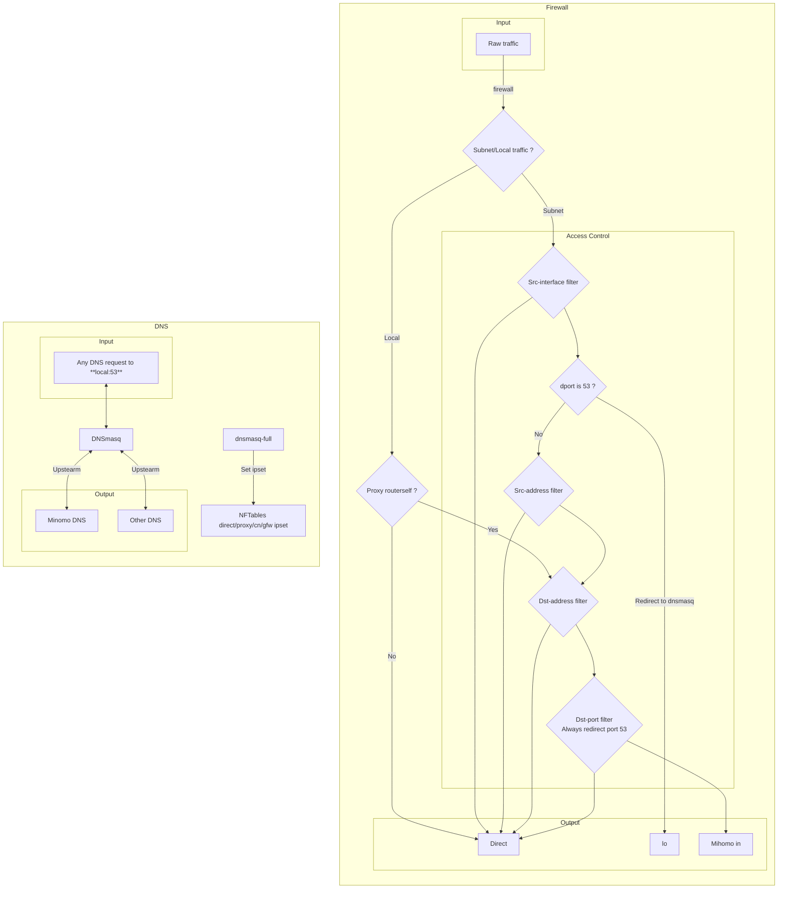

# FullCombo Shark!


[](./LICENSE)

[](https://github.com/fcshark-org/openwrt-fchomo/discussions)
[](https://t.me/fc_shark)
<!--  -->

## Features

- Gateway Transparent proxy
- Gateway FullCone NAT
- Access control Whitelist/Blacklist
- Routing control based on Port/IP/Domain
- Complete DNS hijacking prevents any 53 port query behavior that bypasses the gateway
- DNS requests intelligent routing based on EDNS-Client-Subnet/Policy
- Based on mihomo documentation, fully visual configuration GUI

## Requirements

- OpenWrt >= 24.10
- firewall4

## Known issues

- The **Routing rule** and **Sub rule** of the old version LuCI app have been migrated from `mihomo` format to `json` format.\
  If find `option oldentry` in `/etc/config/fchomo` file, the selected options may not be migrated correctly.\
  You need to manually reset the selected config and remove the `oldentry` option when you are done.

## Screenshots


## Simplified architecture diagram

<details><summary>Expand/Collapse</summary>


</details>

## Releases

You can find the prebuilt-ipks [here](https://fantastic-packages.github.io/packages/)

## Installation

If you have trouble downloading resource files after initial installation, you can upload the [initial resource pack][].

## Example config

Used to override `/etc/config/fchomo`

[bypasscn](./luci-app-fchomo/docs/example/bypasscn.config)</br>
[gfwlist](./luci-app-fchomo/docs/example/gfwlist.config)

## Fullcone Configuration

<details><summary>Direct</summary>

1. add `Dst-address` to `Global > Access Control > Custom Direct list` (domain requires `dnsmasq-full`)
2. (Optional) remove `Dst-port` on `Global > Access Control > Routing Control > Routing port (UDP)`
3. accept input `Dst-port` on `Network > Firewall > Traffic Rules`, requires the upstream link is Fullcone
</details>

<details><summary>Proxy</summary>

1. (Optional) add `Dst-address` to `Global > Access Control > Custom Proxy list` (domain requires `dnsmasq-full`)
2. add `Dst-port` on `Global > Access Control > Routing Control > Routing port (UDP)`
3. add rule to `Client > Routing rule`, requires the dest `Proxy group` is Fullcone link
</details>

## Build

``` bash
# Take the x86_64 platform as an example
tar xjf openwrt-sdk-23.05.3-x86-64_gcc-12.3.0_musl.Linux-x86_64.tar.xz
# Go to the SDK root dir
cd openwrt-sdk-*-x86_64_*
# First run to generate a .config file
make menuconfig
./scripts/feeds update -a
./scripts/feeds install -a
# Get Makefile
git clone --depth 1 --branch master --single-branch --no-checkout https://github.com/fcshark-org/openwrt-fchomo.git package/openwrt-fchomo
pushd package/openwrt-fchomo
umask 022
git checkout
popd
# Select the package LuCI -> Applications -> luci-app-fchomo
make menuconfig
# Start compiling
make package/luci-app-fchomo/compile V=s BUILD_LOG=y -j$(nproc)
```

[initial resource pack]: https://github.com/fcshark-org/openwrt-fchomo/raw/refs/heads/initialpack/initial.tgz
